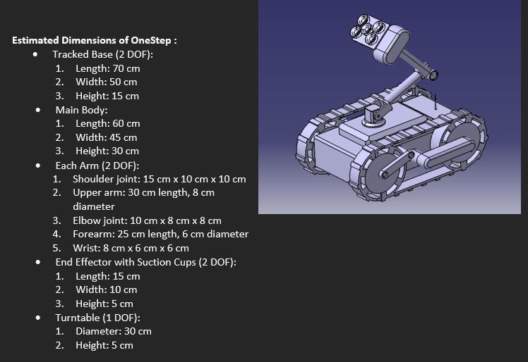
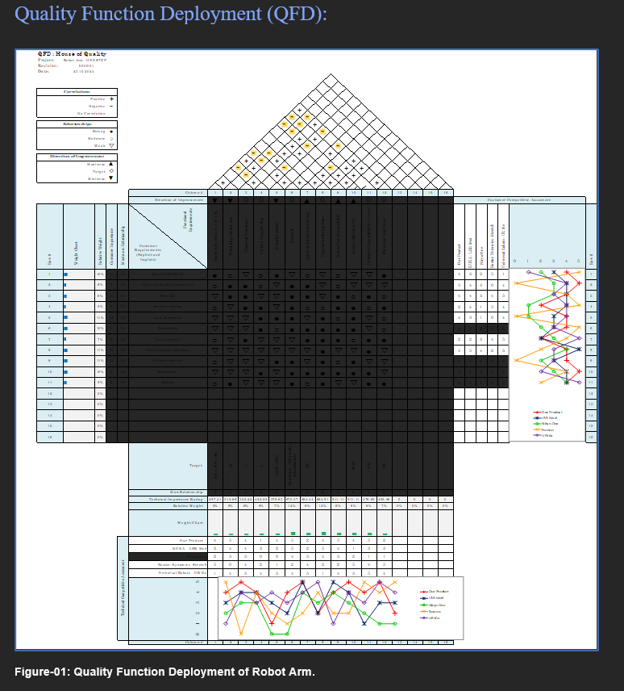
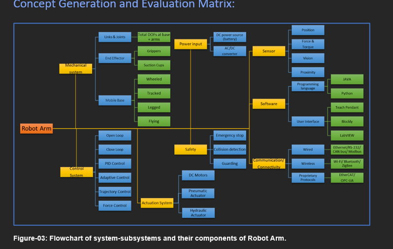
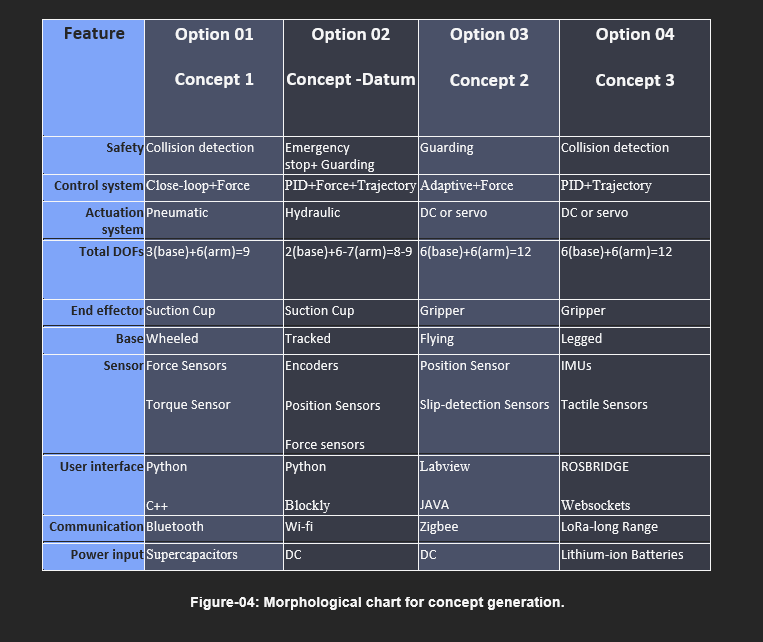
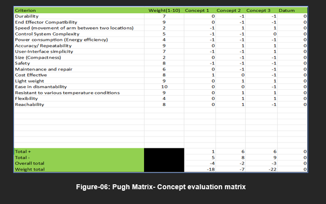
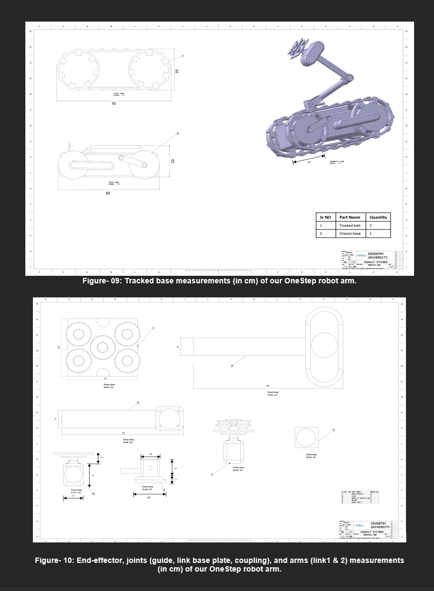
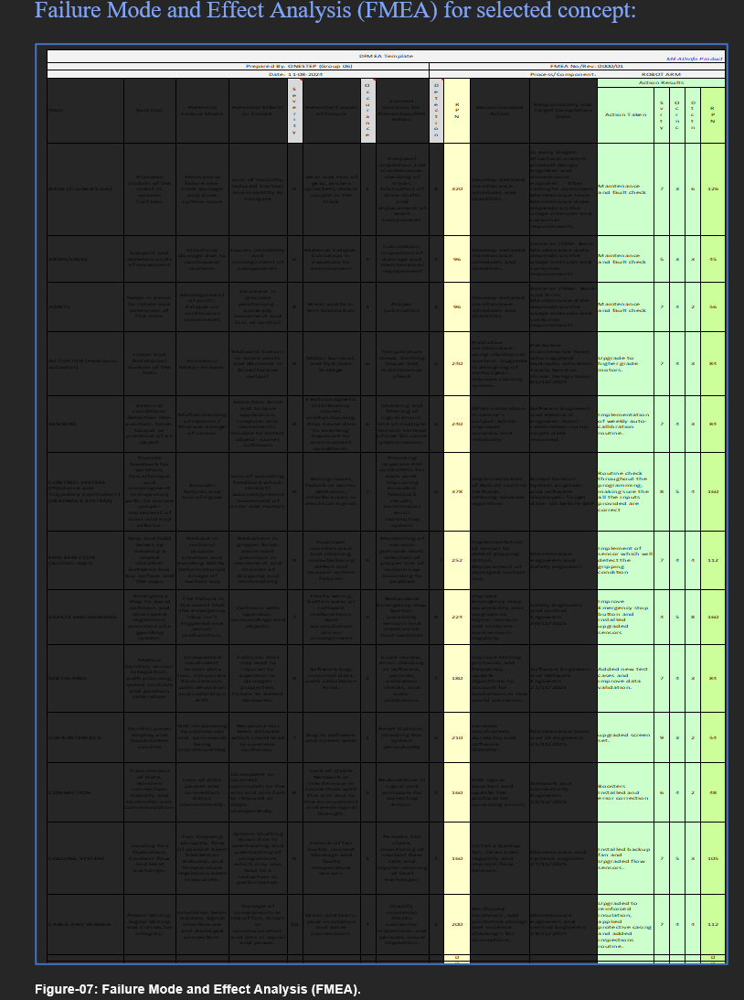

# OneStep Robotic Arm Design Project

A team-based engineering design project focused on developing a lightweight, dismantlable and cost-conscious robotic system for transporting medicine boxes within hospital environments.

The project combined QFD, morphological analysis, Pugh Matrix evaluation, FMEA, DFMA and CAD modelling.

## Final Design

## Project Objective

The aim was to design a robotic arm system capable of handling medicine boxes up to:

- 2 kg payload
- 50 cm package size
- Approximately 700 mm reach

The design also considered:

- Interchangeable end-effectors
- Ease of maintenance
- Disassembly and recycling
- Safety
- Manufacturability
- Cost
- Adaptability for future use

## Design Process

1. Customer and technical requirement identification
2. Benchmarking of existing robotic systems
3. Quality Function Deployment (QFD)
4. Concept generation using morphological analysis
5. Concept evaluation using a Pugh Matrix
6. CAD development
7. Failure Mode and Effects Analysis (FMEA)
8. Design for Manufacture and Assembly (DFMA)
9. Final design evaluation

## QFD and Benchmarking

A House of Quality was developed to translate user requirements into measurable engineering characteristics.

## Concept Generation

Multiple system concepts were developed and compared using morphological analysis and a weighted Pugh Matrix.

## Selected Design

The selected concept used a tracked mobile base with a robotic arm and suction-based end-effector.

## FMEA

A Design FMEA was carried out across the major mechanical, electrical, control and safety elements of the system.

## DFMA

DFMA was used to evaluate material selection, manufacturing processes, assembly methods, maintenance and cost.

## Tools and Methods

- CATIA
- CAD modelling
- QFD
- House of Quality
- FMEA
- DFMA
- Pugh Matrix
- Morphological Analysis
- Engineering benchmarking
- Microsoft Excel

## Project Type

Team engineering design project completed as part of MSc Automotive Engineering studies.

## My Contribution

I contributed as a member of the five-person project team across:

- Engineering requirement development
- QFD and benchmarking
- Concept generation and evaluation
- Pugh Matrix assessment
- FMEA-based risk analysis
- DFMA considerations
- CAD/design development
- Technical documentation
